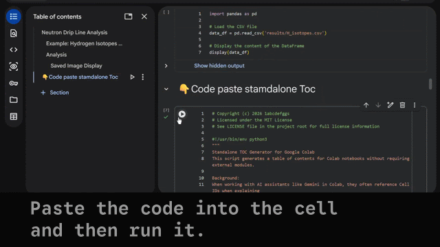

# Cell ID Call, Map the cell ID and heading in the `clab`.
## Generate: Table of Contents for Cell IDs

The easiest way is to paste the Standalone code into the cell and run it.


### Standalone Version
Copy the code from [GitHub Gist](https://gist.github.com/1abcdefggs/21632dd1f3670e8d1506e4788ab514cc) to your Colab notebook and run it directly.

## Sample Notebook

See [analysis.ipynb](notebooks/analysis.ipynb) for a sample notebook demonstrating the tool in action.

**Note:** This sample notebook is from the [neutron-drip-line](https://github.com/1abcdefggs/neutron-drip-line) repository (MIT License).


**Version: 0.3.0**
In Google Colab, cell IDs (the unique identifiers for each code or text cell) can change when you add, delete, or reorder cells. This often leads to broken anchor links in your Table of Contents, making it difficult to navigate within your notebook. This tool was developed to solve this problem by generating stable, persistent anchor links.

## Project Structure
```
cell-id-call/
├── src/                    # Module version
│   ├── __init__.py
│   └── toc_generator.py    # Core TOC generation logic
├── scripts/                # Standalone version
│   └── standalone_toc.py   # Standalone script for Gist distribution
├── notebooks/              # Development notebooks
│   ├── cell_id_call.ipynb # Main development notebook
│   └── analysis.ipynb # Sample notebook from neutron-drip-line repository
├── assets/                 # Static assets
│   └── toc-demo.gif        # Demo GIF
├── README.md
├── CHANGELOG.md
└── LICENSE
```

## Usage

### Module Version
```python
import sys
sys.path.append('src')
import toc_generator

toc_generator.set_toc_len(70)
toc_generator.generate_advanced_toc(
    filter_type="All",
    keyword="",
    show_stats=True,
    strict_id_match=False,
    show_jump_links=True,
    save_log=True
)
```


